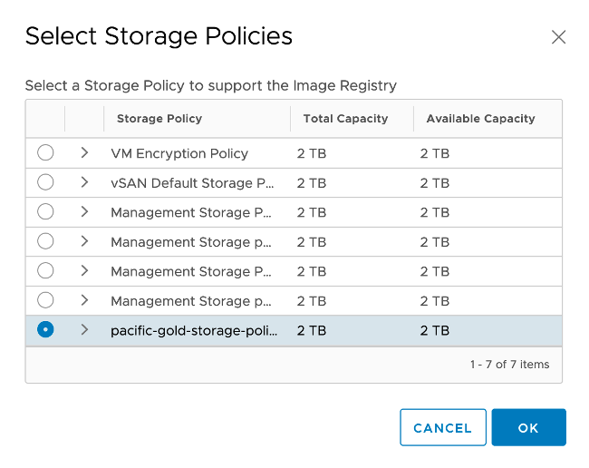
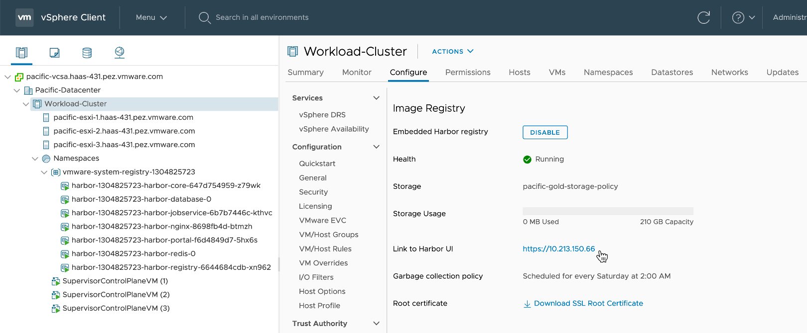
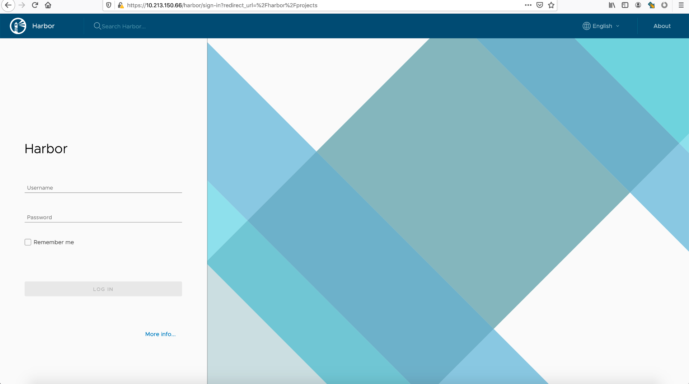

# 3. Harbor Registry Service 활성화

### Harbor Registry Service 활성화하기
- [Hosts and Clusters] 메뉴에서 대상 클러스터 선택 > [Configure] 탭 > [Namespaces] > [Image Registry] 메뉴로 이동합니다.

- 서비스 활성화를 위해 [ENABLE HARBOR] 클릭

  

- Image Registry가 사용할 Storage Policy를 지정합니다.

  
    
- 활성화 완료
  * 왼쪽 메뉴 트리에서 vmware-system-registry로 시작하는 namespace가 생성되고 vSphere Pod 형태로 Harbor Registry Service가 설치된 것을 볼 수 있습니다.

  

- 링크를 클릭하여 Harbor UI에 접속할 수 있습니다.
  * 관리자로 접속가능하며, 이후 namespace 생성시 등록된 사용자로 로그인할 수 있습니다. 이후 실습에서 다시 확인하게 됩니다.

  
