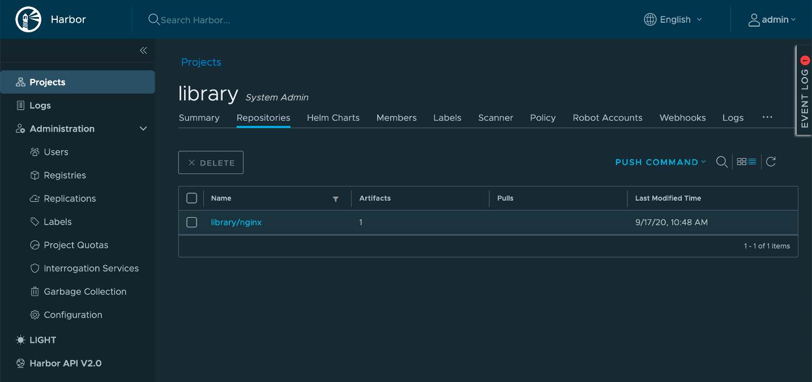
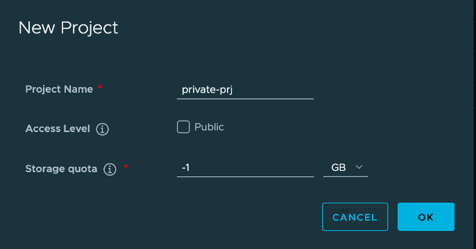

### kubectl login
kubectl를 통해 아래 명령과 같이 Supervisor Cluster에 로그인합니다.
- 이하에서 특별한 언급이 없으면 alana 유저로 로그인합니다.
- context name 혼동 방지를 위해 KUBECONFIG 환경변수를 설정합니다.

### Custom Image Registry(HTTPS) 이미지 테스트
Private Image Registry를 별도로 구성하고 HTTPS로 통신하는 경우에도 공인기관의 SSL 인증서를 사용하는 이미지 레지스트리에서 이미지를 가져와서 사용하는 것은 별다른 추가 설정없이 바로 사용할 수 있습니다.
내부 설치용으로 사용하는 경우 Self Signed Certificate을 사용하는 경우가 많기 때문에 이부분에 대한 연동이 필요합니다.
Harbor Registry을 VM에 별도로 설치하고 Self Signed Certificate를 사용하여 HTTPS로 연동하는 경우에 대해서 확인해 봅니다.

#### Harbor VM 준비
- 공식 문서 가이드를 통해 Harbor를 VM에 설치합니다.
  * https://goharbor.io/docs/2.0.0/install-config/

#### Harbor VM에 nginx 이미지 등록
Harbor Registry Service에 이미지 등록한 것과 동일한 방법으로 Harbor VM에 이미지를 등록합니다. 기본으로 제공되는 Public Project인 library를 사용합니다. Public인 경우 인증없이 이미지 Pull이 가능합니다.

- Docker Client에 Insecure Registry 등록
Harbor Service Registry 인증서가 Self Signed Certificate로 Docker Client에 관련 설정이 필요합니다.
Root 권한으로 /etc/docker/daemon.json 파일을 생성하고 아래와 Harbor Service의 주소를 입력합니다. 그리고 docker를 재시작 합니다.
{{< highlight bash "hl_lines=4)
{
  "insecure-registries": [
    "10.213.208.67",
    "harbor-vm.haas-401.pez.vmware.com"
  ]
}


- Docker 재시작

systemctl restart docker


- nginx 이미지 등록

ubuntu@jumpbox:~$ docker login harbor-vm.haas-401.pez.vmware.com
ubuntu@jumpbox:~$ docker pull nginx:latest
ubuntu@jumpbox:~$ docker tag nginx:latest harbor-vm.haas-401.pez.vmware.com/library/nginx:latest
ubuntu@jumpbox:~$ docker push harbor-vm.haas-401.pez.vmware.com/library/nginx:latest


- Harbor에서 등록된 이미지 확인
  

#### Custom Image Registry(HTTPS) 이미지 테스트
아래와 같이 Harbor VM에 등록한 이미지를 사용하여 배포합니다.

kubectl create deployment nginx-harbor-vm --image=harbor-vm.haas-401.pez.vmware.com/library/nginx


  - 실행결과
    * 이미지를 가져오면서 아래와 같이 `x509: certificate signed by unknown authority` 오류가 나는 것을 볼수 있습니다.
{{< highlight bash "hl_lines=1 3 6 17)
ubuntu@jumpbox:~$ kubectl create deployment nginx-harbor-vm --image=harbor-vm.haas-401.pez.vmware.com/library/nginx
deployment.apps/nginx-harbor-vm created
ubuntu@jumpbox:~$ kubectl get pod
NAME                                READY   STATUS         RESTARTS   AGE
nginx-docker-hub-64dd47cf9c-gn68k   1/1     Running        0          2m11s
nginx-harbor-svc-dd4cb87d5-smph9    1/1     Running        0          2m11s
nginx-harbor-vm-5d5b854fdd-7skwm    0/1     ErrImagePull   0          20s
ubuntu@jumpbox:~$ kubectl describe pod nginx-harbor-vm-5d5b854fdd-7skwm
Name:           nginx-harbor-vm-5d5b854fdd-7skwm
Namespace:      ns1
~~~
Events:
  Type     Reason                        Age                From                                                 Message
  ----     ------                        ----               ----                                                 -------
~~~
  Normal   Pulling                       28s                kubelet, pacific-esxi-2                              Waiting for Image ns1/nginx-c0d9174b8abccc88a02a1bf4858fffdfea17de91-v73332
  Warning  Failed                        28s                kubelet, pacific-esxi-2                              failed to get images: Image ns1/nginx-c0d9174b8abccc88a02a1bf4858fffdfea17de91-v73332 has failed. Error: Failed to resolve on node pacific-esxi-1. Reason: Http request failed. Code 400: ErrorType(2) failed to do request: Head https://harbor-vm.haas-401.pez.vmware.com/v2/library/nginx/manifests/latest: x509: certificate signed by unknown authority


### Certificate 등록하기
Self-Signed Certificate을 사용하는 Image Regitry와 연계하는 경우 Supervisor Cluster상에서 연동하는 경우 image-fetcher-ca-bundle에 Custom CA를 등록해 주는 작업이 필요합니다. 아래 절차에 따라 등록작업을 수행합니다. kube-system에 있는 자원의 수정작업으로 관리자에 의한 작업이 필요합니다.

- Harbor VM 설치시 사용한 인증서를 준비합니다.
  * 예시

ubuntu@harbor-vm:~/media$ cat ca.crt 
-----BEGIN CERTIFICATE-----
MIIF3TCCA8WgAwIBAgIUdNYbCrPEN0kqgx/3+cvSZGca8FUwDQYJKoZIhvcNAQEN
...
InhmkXzLZkwgpVzaPetpmQY=
-----END CERTIFICATE-----


kubectl를 통해 관리자로 Supervisor Cluster에 로그인합니다.
- context name 혼동 방지를 위해 KUBECONFIG 환경변수를 설정합니다.

export KUBECONFIG=$HOME/.kube/config
kubectl vsphere login --insecure-skip-tls-verify --server wcp.haas-401.pez.vmware.com -u administrator@vsphere.local


- 아래 명령을 통해 Harbor에서 사용된 CA 인증서를 등록해 줍니다. 여러개를 등록하는 경우 -----END CERTIFICATE----- 다음 줄에 동일한 방식으로 추가하면 됩니다.


#### Custom Image Registry(HTTPS) 이미지 재 테스트

- alana 유저로 로그인합니다.

아래와 같이 Harbor VM에 등록한 이미지를 사용하여 배포합니다.

kubectl create deployment nginx-harbor-vm --image=harbor-vm.haas-401.pez.vmware.com/library/nginx


  - 실행결과
    * 이미지를 가져와서 정상적으로 실행되어 Running 상태임을 알 수 있습니다.
{{< highlight bash "hl_lines=1 7)
ubuntu@jumpbox:~$ kubectl create deployment nginx-harbor-vm --image=harbor-vm.haas-401.pez.vmware.com/library/nginx
deployment.apps/nginx-harbor-vm created
ubuntu@jumpbox:~$ kubectl get all -n ns1
NAME                                    READY   STATUS    RESTARTS   AGE
pod/nginx-docker-hub-64dd47cf9c-gn68k   1/1     Running   0          169m
pod/nginx-harbor-svc-dd4cb87d5-smph9    1/1     Running   0          169m
pod/nginx-harbor-vm-5d5b854fdd-h52qb    1/1     Running   0          35s

NAME                           TYPE           CLUSTER-IP    EXTERNAL-IP     PORT(S)        AGE
service/nginx-docker-hub-svc   LoadBalancer   10.96.0.125   10.213.208.66   80:30667/TCP   19h

NAME                               READY   UP-TO-DATE   AVAILABLE   AGE
deployment.apps/nginx-docker-hub   1/1     1            1           19h
deployment.apps/nginx-harbor-svc   1/1     1            1           16h
deployment.apps/nginx-harbor-vm    1/1     1            1           35s

NAME                                          DESIRED   CURRENT   READY   AGE
replicaset.apps/nginx-docker-hub-64dd47cf9c   1         1         1       19h
replicaset.apps/nginx-harbor-svc-dd4cb87d5    1         1         1       16h
replicaset.apps/nginx-harbor-vm-5d5b854fdd    1         1         1       35s


### Private Registry 연동

#### Harbor VM에 nginx 이미지 등록
Harbor UI에서 이미지 접근시 인증이 필요한 Private Project를 만들고 이전과 동일한 방식으로 nginx 이미지를 등록합니다.
- Access Level: 체크 안함

  


docker login harbor-vm.haas-401.pez.vmware.com
docker pull nginx:latest
docker tag nginx:latest harbor-vm.haas-401.pez.vmware.com/private-prj/nginx:latest
docker push harbor-vm.haas-401.pez.vmware.com/private-prj/nginx:latest


앞서 Docker Login을 통해 Harbor VM에 로그인한 상태입니다. 그 정보를 이용하여 아래 명령을 통해 kubernetes에 secret을 생성합니다.

kubectl create secret generic ns1-harbor-vm-pull-secret -n ns1 \
    --from-file=.dockerconfigjson=$HOME/.docker/config.json \
    --type=kubernetes.io/dockerconfigjson
   

- 예시
{{< highlight bash "hl_lines=10)
ubuntu@jumpbox:~$ kubectl create secret generic ns1-harbor-vm-pull-secret -n ns1 \
>     --from-file=.dockerconfigjson=$HOME/.docker/config.json \
>     --type=kubernetes.io/dockerconfigjson
secret/ns1-harbor-vm-pull-secret created
ubuntu@jumpbox:~$ kubectl get secret -n ns1
NAME                            TYPE                                  DATA   AGE
default-token-nqkct             kubernetes.io/service-account-token   3      22h
ns1-default-image-pull-secret   kubernetes.io/dockerconfigjson        1      22h
ns1-default-image-push-secret   kubernetes.io/dockerconfigjson        1      22h
ns1-harbor-vm-pull-secret       kubernetes.io/dockerconfigjson        1      15s


#### Custom Image Registry(HTTPS) 이미지 테스트

- alana 유저로 로그인합니다.

아래와 같이 Harbor VM에 등록한 이미지를 사용하여 배포합니다.
{{< highlight bash "hl_lines=23)
apiVersion: apps/v1
kind: Deployment
metadata:
  name: nginx-harbor-vm-secret-deployment
  labels:
    app: nginx-harbor-vm-app-4
spec:
  replicas: 1
  selector:
    matchLabels:
      app: nginx-harbor-vm-app-4
  template:
    metadata:
      labels:
        app: nginx-harbor-vm-app-4
    spec:
      containers:
      - name: nginx-harbor-vm-app-4
        image: harbor-vm.haas-401.pez.vmware.com/private-prj/nginx:latest
        ports:
        - containerPort: 80
      imagePullSecrets:
       - name: ns1-harbor-vm-pull-secret


- 실행결과

ubuntu@jumpbox:~$ kubectl get pod | grep secret
nginx-harbor-vm-secret-deployment-949455996-gz6cl   1/1     Running   0          2m16s
