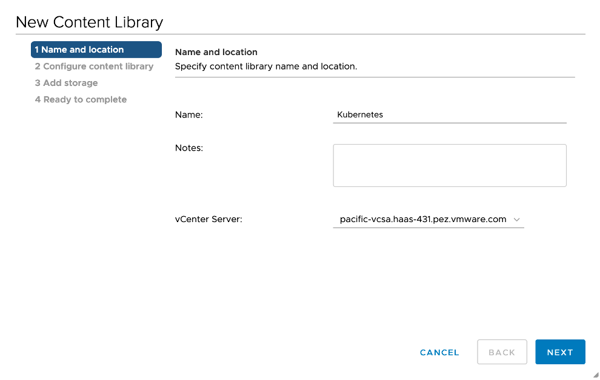
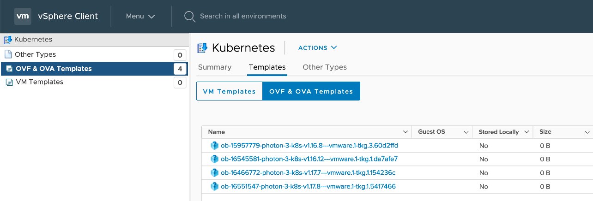
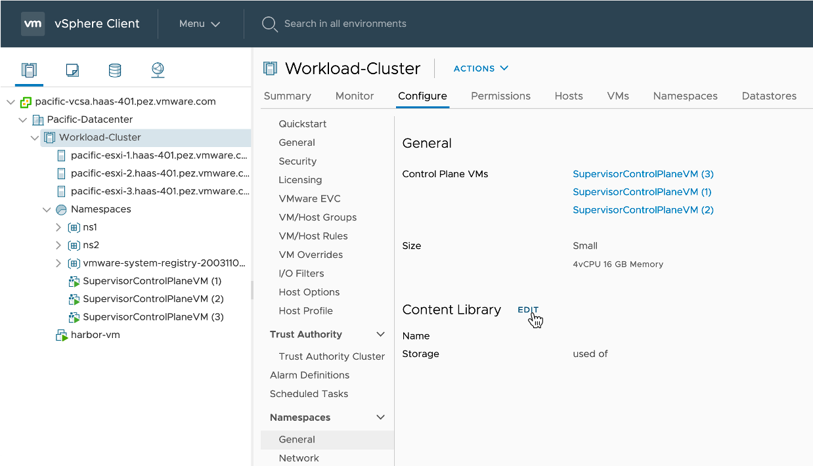
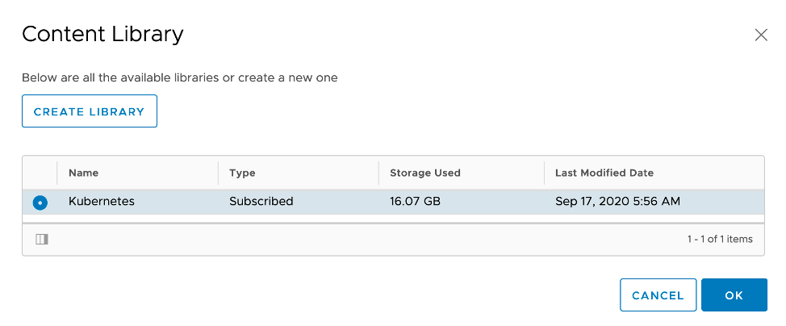

## 1. Content Library 등록

### Content Library 등록하기
TKG를 이용하여 Tanzu Kubernetes Cluster(Guest Cluster)를 만들기 위해 Node 생성을 위한 템플릿 이미지를 Content Library를 통해 관리합니다. TKC를 만들기전에 최초 한번 등록작업이 필요합니다. 아래 작업은 인터넷이 가능한 환경에서 동기화 해서 가져오는 방법입니다. 수동으로 업로드 하는 방법 또한 지원합니다.

- [Menu] > [Content Libraries] 메뉴로 이동합니다.

  

- 라이브러리 이름 입력

  

- 라이브러 설정
  * 인터넷 접속 환경: 구독할 URL로 다음값을 입력합니다.
    + https://wp-content.vmware.com/v2/latest/lib.json

    

  * 인터넷 차단 환경
    + Local Content Library를 사용하면 됩니다.
    + 이미지는 별도로 다운로드 받아 업로드하는 작업이 필요합니다.
    + 다운로드 위치: https://wp-content.vmware.com/v2/latest


- 라이브러리(Kubernetes 이미지)가 저장될 DataStore를 지정합니다.

  

- 동기화를 하게 되면 그림과 같이 이미지 정보를 가져오게 됩니다.
  * 이 정보는 이후 Tanzu Kubernetes Cluster를 만들때 사용될 VM이미지입니다.

  

### Tanzu Kubernetes Cluster의 Content Library 등록
- Guest Cluster인 Tanzu Kubernetes Cluster에서 사용할 라이브러리를 등록하는 과정이 필요합니다.

- [Hosts and Clusters] 메뉴에서 대상 클러스터 선택 > [Configure] 탭 > [Namespaces] > [General] 메뉴로 이동합니다. Content Library 옆 [EDIT] 클릭

  

- 라이브러리 리스트에서 앞서 등록한 Kubernetes Content Libray 등록  

  

- `kubectl get virtualmachineimage` 명령을 실행하면 Content Library상의 이미지가 조회되는 것을 알 수 있습니다.
```
ubuntu@jumpbox:~$ kubectl get virtualmachineimage
NAME                                                         VERSION                           OSTYPE
ob-15957779-photon-3-k8s-v1.16.8---vmware.1-tkg.3.60d2ffd    v1.16.8+vmware.1-tkg.3.60d2ffd    vmwarePhoton64Guest
ob-16466772-photon-3-k8s-v1.17.7---vmware.1-tkg.1.154236c    v1.17.7+vmware.1-tkg.1.154236c    vmwarePhoton64Guest
ob-16545581-photon-3-k8s-v1.16.12---vmware.1-tkg.1.da7afe7   v1.16.12+vmware.1-tkg.1.da7afe7   vmwarePhoton64Guest
ob-16551547-photon-3-k8s-v1.17.8---vmware.1-tkg.1.5417466    v1.17.8+vmware.1-tkg.1.5417466    vmwarePhoton64Guest 
```