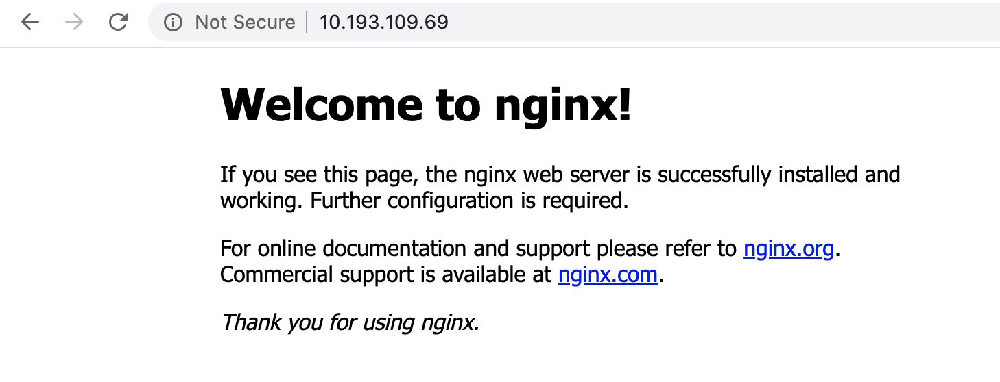

### Harbor Registry Service의 Self Signed Certificate을 TKC의 각 Node에 등록하기

#### 직접 등록
각 Master Node / Worker Node에 직접 SSH 로 접속하여 Harbor Registry의 인증서를 다운받아 등록하는 다음 명령을 수행합니다.
  - 아래는 현재시점에 제공하는 Photon OS기준으로 생성된 Node에 대해 테스트 되었습니다.
```
curl https://10.193.109.66/api/systeminfo/getcert -k -o 10.193.109.66.crt
sudo cp 10.193.109.66.crt /etc/ssl/certs/10.193.109.66.crt
sudo /usr/bin/rehash_ca_certificates.sh
sudo systemctl restart containerd
```

#### 스크립트를 통한 등록
외부에서 접근이 가능하고 TKC 클러스터 노드에 접근 되는 위치에서 다음을 수행해야 합니다.

  - 스크립트로 복사하고 필요한 패키지(curl, jq, sshpass)가 없는 경우 설치합니다.
```
git clone https://github.com/TheKoguryo/vsphere-k8s-scripts.git
cd vsphere-k8s-scripts/

sudo apt -y install curl
sudo apt -y install jq
sudo apt -y install sshpass
```

  - tkg-insecure-registry-containerd.sh 파일에 서버정보 업데이트
```
SV_IP='10.193.109.45' #VIP for the Supervisor Cluster
VC_IP='pacific-vcsa.haas-415.pez.pivotal.io' #URL for the vCenter
VC_ADMIN_USER='administrator@vsphere.local' #User for the Supervisor Cluster
VC_ADMIN_PASSWORD='~~~~~~' #Password for the Supervisor Cluster user
```

  - 스크립트 실행
```
./tkg-insecure-registry-containerd.sh $tkc-cluster-name $namespace $url-registry
```

  - 실행결과
```
ubuntu@jumpbox:~/GitHub/vsphere-k8s-scripts$ ./tkg-insecure-registry-containerd.sh tkc-cluster-1 ns1 10.193.109.66
curl 7.58.0 (x86_64-pc-linux-gnu) libcurl/7.58.0 OpenSSL/1.1.1 zlib/1.2.11 libidn2/2.0.4 libpsl/0.19.1 (+libidn2/2.0.4) nghttp2/1.30.0 librtmp/2.3
Release-Date: 2018-01-24
Protocols: dict file ftp ftps gopher http https imap imaps ldap ldaps pop3 pop3s rtmp rtsp smb smbs smtp smtps telnet tftp 
Features: AsynchDNS IDN IPv6 Largefile GSS-API Kerberos SPNEGO NTLM NTLM_WB SSL libz TLS-SRP HTTP2 UnixSockets HTTPS-proxy PSL 
jq-1.5-1-a5b5cbe
sshpass 1.06
(C) 2006-2011 Lingnu Open Source Consulting Ltd.
(C) 2015-2016 Shachar Shemesh
This program is free software, and can be distributed under the terms of the GPL
See the COPYING file for more information.

Using "assword" as the default password prompt indicator.
Fri Jul 31 08:43:45 UTC 2020 INFO: Supervisor cluster is ready!
~~~
Fri Jul 31 08:44:03 UTC 2020 INFO: Registry added successfully!
Fri Jul 31 08:44:03 UTC 2020 INFO: Restarting Docker on node '10.244.1.34'...
Fri Jul 31 08:44:03 UTC 2020 INFO: Docker daemon restarted successfully!
Fri Jul 31 08:44:03 UTC 2020 INFO: Restarting Docker on node '10.244.1.35'...
Fri Jul 31 08:44:04 UTC 2020 INFO: Docker daemon restarted successfully!
Fri Jul 31 08:44:04 UTC 2020 INFO: Cleaning up temporary files...
ubuntu@jumpbox:~/GitHub/vsphere-k8s-scripts$
```

### TKC 클러스터에 디폴트 imagepullsecret 등록하기
  - 다음 명령어를 통해 대상 TKC에 Harbor Registry 로그인 암호를 등록하고 디폴트 imagepullsecret으로 등록합니다.
```

kubectl create secret generic regcred \
    --from-file=.dockerconfigjson=<path/to/.docker/config.json> \
    --type=kubernetes.io/dockerconfigjson

kubectl create secret docker-registry harbor-regcred-ns1 --docker-server=10.193.109.66 --docker-username=administrator@vsphere.local --docker-password=~~~
kubectl patch serviceaccount default -p '{"imagePullSecrets": [{"name": "harbor-regcred-ns1"}]}'
```

### Harbor Registry Service 이미지 테스트
  - Self Signed Certificate을 사용하는 Harbor Registry상의 이미지를 사용하여 아래와 같이 배포해 봅니다.
```
kubectl create deployment nginx-harbor --image=10.193.109.66/ns1/nginx
kubectl expose deployment nginx-harbor --port 80 --type LoadBalancer --name nginx-harbor-svc
```

  - 실행결과
```
ubuntu@jumpbox:~$ kubectl create deployment nginx-harbor --image=10.193.109.66/ns1/nginx
deployment.apps/nginx-harbor created
ubuntu@jumpbox:~$ kubectl expose deployment nginx-harbor --port 80 --type LoadBalancer --name nginx-harbor-svc
service/nginx-harbor-svc exposed
ubuntu@jumpbox:~$ kubectl get all
NAME                                READY   STATUS    RESTARTS   AGE
pod/nginx-harbor-57bd8f555b-n2xkn   1/1     Running   0          71s

NAME                       TYPE           CLUSTER-IP   EXTERNAL-IP     PORT(S)        AGE
service/kubernetes         ClusterIP      10.96.0.1    <none>          443/TCP        51m
service/nginx-harbor-svc   LoadBalancer   10.96.73.0   10.193.109.69   80:31109/TCP   69s
service/supervisor         ClusterIP      None         <none>          6443/TCP       50m

NAME                           READY   UP-TO-DATE   AVAILABLE   AGE
deployment.apps/nginx-harbor   1/1     1            1           71s

NAME                                      DESIRED   CURRENT   READY   AGE
replicaset.apps/nginx-harbor-57bd8f555b   1         1         1       71s
ubuntu@jumpbox:~$
```

  - 정상 서비스 확인
    