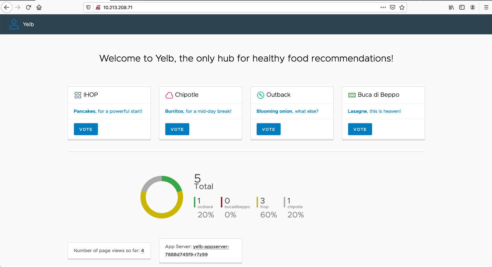
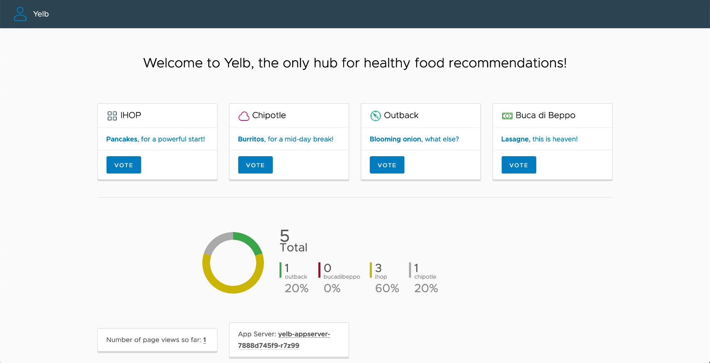
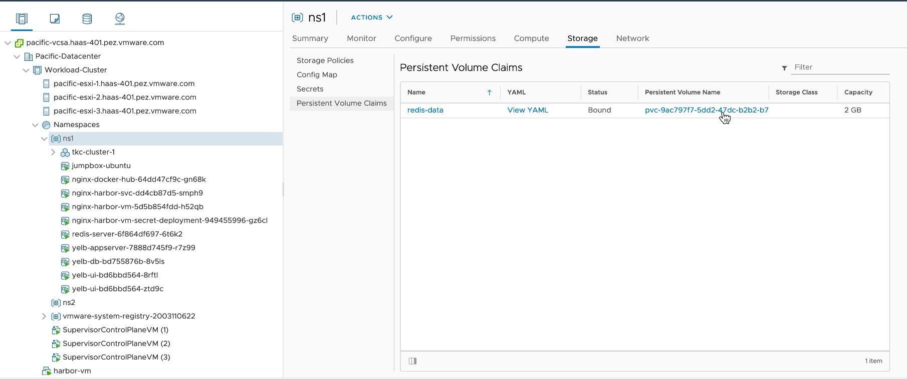
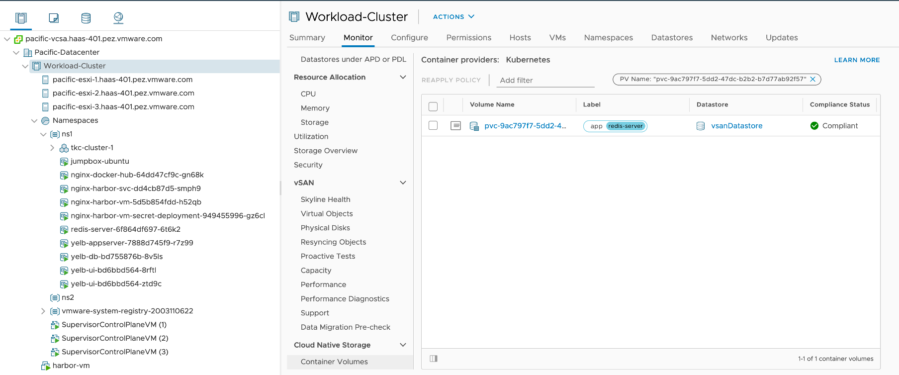

### Yelb 앱 배포
yelb 앱는 선호하는 레스토랑에 대해 투표하는 앱으로 그림과 같은 구조를 가집니다. Persistent Volume을 테스트하기 위한 용도로 배포합니다.
- https://github.com/mreferre/yelb

- alana 유저로 접속
  * Supervisor Namespace로 Context 변경

$ kubectl config use-context ns1
Switched to context "ns1".
$ kubectl config get-contexts
CURRENT   NAME                          CLUSTER                       AUTHINFO                                              NAMESPACE
*         ns1                           10.213.208.65                 wcp:10.213.208.65:alana@vsphere.local                 ns1
          tkc-cluster-1                 10.213.208.68                 wcp:10.213.208.68:alana@vsphere.local                 
          wcp.haas-401.pez.vmware.com   wcp.haas-401.pez.vmware.com   wcp:wcp.haas-401.pez.vmware.com:alana@vsphere.local 
        

- 앱 yaml 파일 확인
yaml 파일을 열어서 봅니다. Persistent Volume 관련 된 설정이 현재는 따로 없습니다.

- 앱 배포

ubuntu@jumpbox:~/tanzu-hol/5.persistent-volume$ kubectl apply -f yelb.yaml 
service/redis-server created
service/yelb-db created
service/yelb-appserver created
service/yelb-ui created
service/yelb-lb-service created
deployment.apps/yelb-ui created
deployment.apps/redis-server created
deployment.apps/yelb-db created
deployment.apps/yelb-appserver created
 

- 앱 배포 확인
  * LoadBalancer의 IP 확인
{{< highlight bash "hl_lines=13)
ubuntu@jumpbox:~/tanzu-hol/5.persistent-volume$ kubectl get all
NAME                                                    READY   STATUS    RESTARTS   AGE
pod/redis-server-5d6f8cbf-fxldq                         1/1     Running   0          5m10s
pod/yelb-appserver-7888d745f9-r7z99                     1/1     Running   0          5m10s
pod/yelb-db-bd755876b-8v5ls                             1/1     Running   0          5m10s
pod/yelb-ui-bd6bbd564-8rftl                             1/1     Running   0          5m10s
pod/yelb-ui-bd6bbd564-ztd9c                             1/1     Running   0          5m11s

NAME                                          TYPE           CLUSTER-IP    EXTERNAL-IP     PORT(S)          AGE
service/redis-server                          ClusterIP      10.96.1.21    <none>          6379/TCP         5m11s
service/yelb-appserver                        ClusterIP      10.96.1.28    <none>          4567/TCP         5m11s
service/yelb-db                               ClusterIP      10.96.0.154   <none>          5432/TCP         5m11s
service/yelb-lb-service                       LoadBalancer   10.96.0.113   10.213.208.71   80:30195/TCP     5m11s
service/yelb-ui                               ClusterIP      10.96.0.51    <none>          80/TCP           5m11s

NAME                                                READY   UP-TO-DATE   AVAILABLE   AGE
deployment.apps/redis-server                        1/1     1            1           5m11s
deployment.apps/yelb-appserver                      1/1     1            1           5m10s
deployment.apps/yelb-db                             1/1     1            1           5m10s
deployment.apps/yelb-ui                             2/2     2            2           5m11s

NAME                                                          DESIRED   CURRENT   READY   AGE
replicaset.apps/redis-server-5d6f8cbf                         1         1         1       5m10s
replicaset.apps/yelb-appserver-7888d745f9                     1         1         1       5m10s
replicaset.apps/yelb-db-bd755876b                             1         1         1       5m10s
replicaset.apps/yelb-ui-bd6bbd564                             2         2         2       5m11s
 

- 앱 테스트
  * 웹브라우저로 확인된 LoadBalancer 주소로 접속합니다.
  * VOTE 버튼을 골고루 클릭해 봅니다.
  * 브라우저를 새로고침 해봅니다.
    + "Number of page views so far"에 뷰 숫자가 변경되는 것을 볼수 있습니다. yelb은 이 값을 redis에 저장합니다.
      

- redis server 삭제
  * 아래와 같이 redis server Pod를 찾아서 삭제합니다.

ubuntu@jumpbox:~/tanzu-hol/5.persistent-volume$ kubectl get pod | grep redis
redis-server-5d6f8cbf-fxldq                         1/1     Running   0          18m
ubuntu@jumpbox:~/tanzu-hol/5.persistent-volume$ kubectl delete pod redis-server-5d6f8cbf-fxldq
pod "redis-server-5d6f8cbf-fxldq" deleted
ubuntu@jumpbox:~/tanzu-hol/5.persistent-volume$ kubectl get pod | grep redis
redis-server-5d6f8cbf-zpwhz                         0/1     Pending   0          11s
ubuntu@jumpbox:~/tanzu-hol/5.persistent-volume$ kubectl get pod | grep redis
redis-server-5d6f8cbf-zpwhz                         1/1     Running   0          12s
 

- 앱 재접속
  * 접속한 브라우저를 새로고침하면 그림과 같이 "Number of page views so far"가 1로 초기회 된 것을 볼수 있습니다.
  * Persistent Volume을 사용하고 있지 않기 때문에 Pod가 재생성되면서 기존 데이터가 사라졌습니다.
  

### Persistent Volume 생성
현재 vSphere with Tanzu에서 제공하는 CNS-CSI에서는 ReadWriteOnce만을 지원합니다. 자세한 내용은 아래 링크를 참조합니다.
- https://docs.vmware.com/en/VMware-vSphere/7.0/vmware-vsphere-with-kubernetes/GUID-89129F58-54BA-4BE5-A251-358AE333B6FC.html

- StorageClass 이름을 각자환경에 맞게 수정하여 PVC를 생성합니다.
       

  * 적용

ubuntu@jumpbox:~/tanzu-hol/5.persistent-volume$ kubectl apply -f redis-data.yml 
persistentvolumeclaim/redis-data created
ubuntu@jumpbox:~/tanzu-hol/5.persistent-volume$ kubectl get pvc
NAME         STATUS   VOLUME                                     CAPACITY   ACCESS MODES   STORAGECLASS                  AGE
redis-data   Bound    pvc-9ac797f7-5dd2-47dc-b2b2-b7d77ab92f57   2Gi        RWO            pacific-gold-storage-policy   29s
    

- redis-server에 PVC 적용
{{< highlight bash "hl_lines=28-29)
ubuntu@jumpbox:~/tanzu-hol/5.persistent-volume$ cat yelb-redis-pv.yaml 
apiVersion: apps/v1
kind: Deployment
metadata:
  name: redis-server
spec:
  replicas: 1
  selector:
    matchLabels:
      app: redis-server
  template:
    metadata:
      labels:
        app: redis-server
        tier: cache
        appstack: yelb
    spec:
      containers:
      - name: redis-server
        image: redis
        ports:
        - containerPort: 6379
        volumeMounts:
        - name: redis-data
          mountPath: /data
      volumes:
      - name: redis-data
        persistentVolumeClaim:
          claimName: redis-data
ubuntu@jumpbox:~/tanzu-hol/5.persistent-volume$ kubectl apply -f yelb-redis-pv.yaml 
deployment.apps/redis-server configured
ubuntu@jumpbox:~/tanzu-hol/5.persistent-volume$ kubectl get pod | grep redis
redis-server-5d6f8cbf-zpwhz                         1/1     Terminating   0          19m
redis-server-6f864df697-xdwtc                       1/1     Running       0          25s
  

- redis Pod 조회
  * `kubectl describe pod <Pod Name>`로 조회해 봅니다.
  * Persistent Volume이 붙은 것을 볼 수 있습니다.
{{< highlight bash "hl_lines=17-19 27-30 44)
ubuntu@jumpbox:~/tanzu-hol/5.persistent-volume$ kubectl describe pod redis-server-6f864df697-xdwtc
Name:         redis-server-6f864df697-xdwtc
Namespace:    ns1
....
Containers:
  redis-server:
    Container ID:   754ca420-c015-4ab4-9866-7968454d1c2c
    Image:          redis
    Image ID:       
    Port:           6379/TCP
    Host Port:      0/TCP
    State:          Running
      Started:      Fri, 18 Sep 2020 00:40:29 -0700
    Ready:          True
    Restart Count:  0
    Environment:    <none>
    Mounts:
      /data from redis-data (rw)
      /var/run/secrets/kubernetes.io/serviceaccount from default-token-nqkct (ro)
Conditions:
  Type              Status
  PodScheduled      True 
  Initialized       True 
  ContainersReady   True 
  Ready             True 
Volumes:
  redis-data:
    Type:       PersistentVolumeClaim (a reference to a PersistentVolumeClaim in the same namespace)
    ClaimName:  redis-data
    ReadOnly:   false
  default-token-nqkct:
    Type:        Secret (a volume populated by a Secret)
    SecretName:  default-token-nqkct
    Optional:    false
QoS Class:       BestEffort
Node-Selectors:  <none>
Tolerations:     node.kubernetes.io/not-ready:NoExecute for 300s
                 node.kubernetes.io/unreachable:NoExecute for 300s
Events:
  Type    Reason                        Age                    From                                                 Message
  ----    ------                        ----                   ----                                                 -------
  Normal  Scheduled                     <unknown>              default-scheduler                                    Successfully assigned ns1/redis-server-6f864df697-xdwtc to pacific-esxi-1
  Normal  Image                         2m47s                  image-controller                                     Image redis-e78aed296f52561d7d73a0380c7678978857cf34-v26426 bound successfully
  Normal  SuccessfulAttachVolume        2m39s                  attachdetach-controller                              AttachVolume.Attach succeeded for volume "pvc-9ac797f7-5dd2-47dc-b2b2-b7d77ab92f57"
  Normal  Pulling                       2m38s                  kubelet, pacific-esxi-1                              Waiting for Image ns1/redis-e78aed296f52561d7d73a0380c7678978857cf34-v26426
  Normal  Pulled                        2m38s                  kubelet, pacific-esxi-1                              Image ns1/redis-e78aed296f52561d7d73a0380c7678978857cf34-v26426 is ready
  Normal  SuccessfulMountVolume         2m34s                  kubelet, pacific-esxi-1                              Successfully mounted volume default-token-nqkct
  Normal  SuccessfulMountVolume         2m34s                  kubelet, pacific-esxi-1                              Successfully mounted volume redis-data
  Normal  Created                       2m34s                  kubelet, pacific-esxi-1                              Created container redis-server
  Normal  Started                       2m29s                  kubelet, pacific-esxi-1                              Started container redis-server
  Normal  SuccessfulRealizeNSXResource  2m28s (x5 over 2m46s)  nsx-container-ncp, 422a38dbfccebc209d8544d58e16f5a6  Successfully realized NSX resource for Pod
    

- 앱 다시 테스트
  * 웹브라우저로 확인된 LoadBalancer 주소로 접속합니다.
  * 브라우저를 몇 번 새로고침 해봅니다.
    + "Number of page views so far"에 뷰 숫자가 변경되는 것을 볼수 있습니다. yelb은 이 값을 redis에 저장합니다.

- redis server 삭제
  * 이전과 같은 방법으로 redis server Pod를 찾아서 삭제합니다.

$ kubectl get pod | grep redis
$ kubectl delete pod <Redis Pod Name>
$ kubectl get pod | grep redis
 

- 앱 재접속
  * 브라우저를 새로고침해도 "Number of page views so far" 값이 유지되는 것을 볼 수 있습니다.
  

### vSphere Client 에서 확인
1. vCenter UI에서 [Hosts and Clusters]을 클릭
1. 대상 클러스터를 클릭하고 Namespaces 아래 ns1 네임스페이스 클릭
1. [Storage] 탭 클릭
1. [Persistent Volume Claims] 클릭
1. 앞서 생성한 PVC를 볼 수 있습니다. PV 이름을 클릭합니다.
  
1. 클러스터의 [Monitor] > [Container Volumes] 화면으로 이동됩니다. Container Volume에 대한 추가 정보를 볼 수 있습니다.
  