## 1. Prometheus & Grafana

### Kubernetes Monitoring
Kubernetes 모니터링을 위해 On-Premise에서는 Prometheus와 Grafana를 이용하여 모니터링할 수 있습니다. 더불어 SaaS 형태로 Tanzu Observablity를 통해 Full Stack 모니터링을 할 수 있습니다. 여기서는 오픈소스 Prometheus & Grafana를 통해 Kubernetes 모니터링을 설정하는 과정의 예시입니다.


### kube-prometheus-stack 설치
여기서는 Kubernetes 모니터링을 위한 모음으로 만들어진 kube-prometheus-stack의 Helm Chart 기반으로 설치하도록 하겠습니다.

- prometheus 설치용 namespace를 만듭니다.
```
kubectl create ns prometheus
```

- Kubeapps Dashboard로 로그인합니다.
  * 해당 IP로 브라우저로 접속한 후 조회된 토큰값을 사용하여 로그인합니다.
  * Linux에서 토근 조회
```
kubectl get secret $(kubectl get serviceaccount kubeapps-operator -o jsonpath='{range .secrets[*]}{.name}{"\n"}{end}' | grep kubeapps-operator-token) -o jsonpath='{.data.token}' -o go-template='{{.data.token | base64decode}}' && echo
```

- Helm Repository 추가하기
  * 앞서 생성한 namespace를 선택

    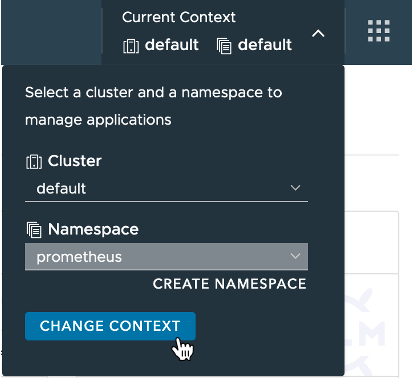

  * [Configurations] 선택

    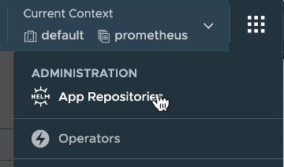 

  * Repository 등록

    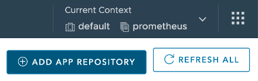 

    + https://prometheus-community.github.io/helm-charts 

      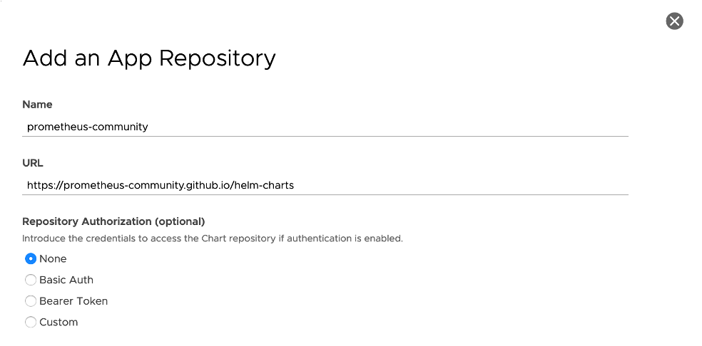   

- Prometheus와 Grafana 설치
  * 등록한 Repository 클릭

  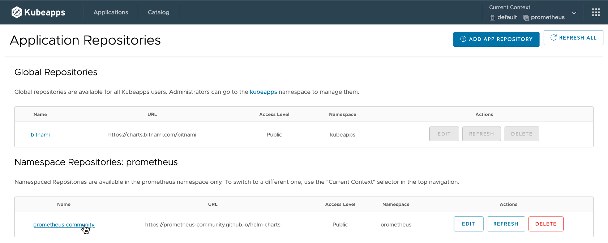  

  * kube-prometheus-stack 선택

  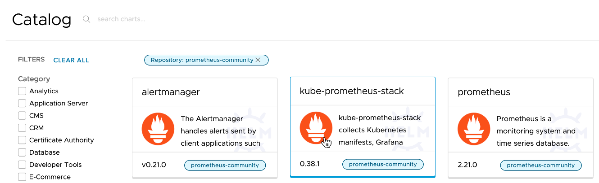  

  * 우측 [Deploy] 클릭

  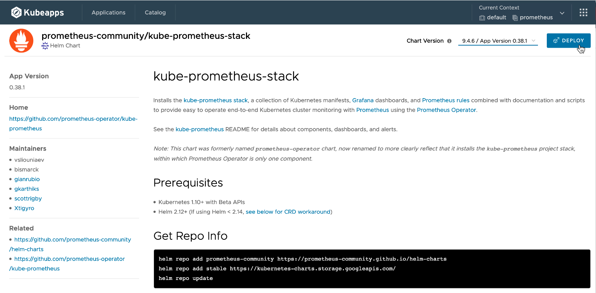

  * Name에 배포 이름을 입력
    + 아래 Value(YAML)에서 변경하고자 하는 값을 변경합니다.

    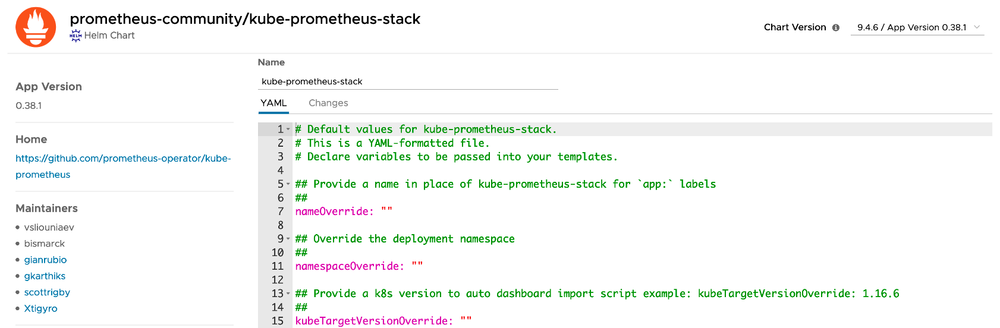 

    + 여기서는 Grafana를 LoadBalancer 타입으로 접속할 수 있도록 아래 위치에 추가합니다. 그리고 [Deploy] 클릭

    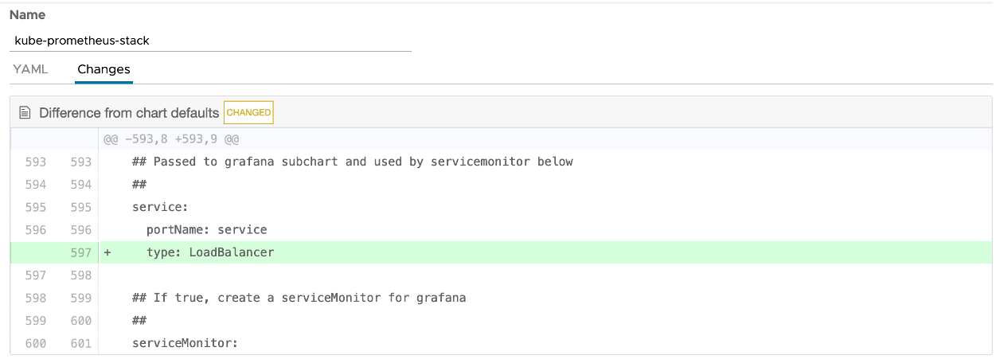

    + 배포시간이 약간 걸립니다.

- 배포 확인
  * Grafana 접속을 위한 URL을 확인하고 접속합니다.
  * 접속 유저 패스워드 기본값은 admin / prom-operator 입니다.
  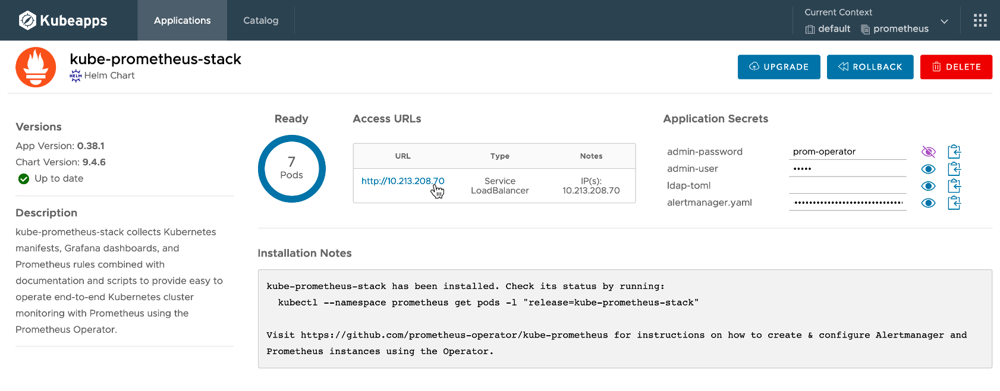  

- 설치된 Grafana 접속합니다.
  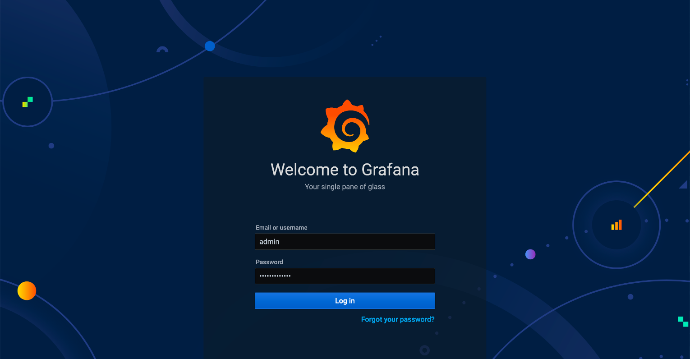  

- 기본 설치된 Dashboard를 아래 순서로 확인합니다.  

  

  

  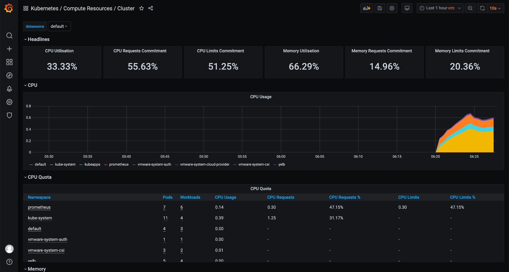  
