### Log Monitoring
Kubernetes 로그 모니터링을 위해 오픈소스 Elastic Search and Kibana를 많이 사용합니다. 여기서는 Fluent Bit을 통한 연동 방법에 대한 실습입니다.

### elasticsearch + kibana 설치
- 설치용 namespace를 만듭니다.

kubectl create ns elasticsearch


- Kubeapps Dashboard로 로그인합니다.

- 생성한 elasticsearch namespace를 오른쪽 상단에서 선택

- elasticsearch 검색 후 선택

  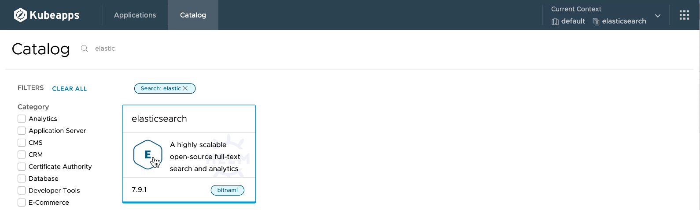   

- [Deploy] 클릭

  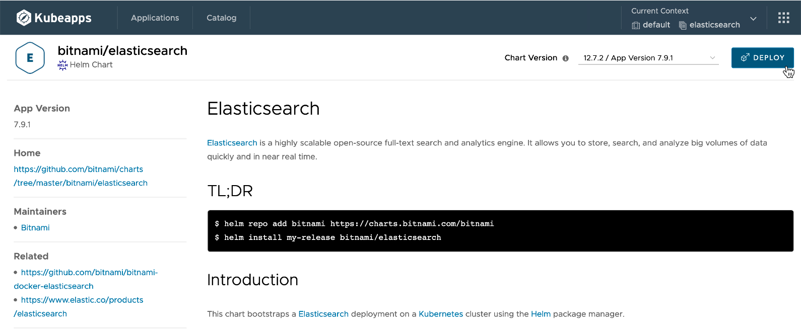    

- Values(YAML)에서 설정값 변경
  * global.storageClass를 사용할 StorageClass로 변경합니다.
  * 내장되어 있는 kibana를 함께 설치합니다. kibana는 외부 접속을 위해 LoadBalancer 타입으로 변경합니다.
  * 줄번호는 Helm Chart 버전에 따라 달라질 수 있습니다.

  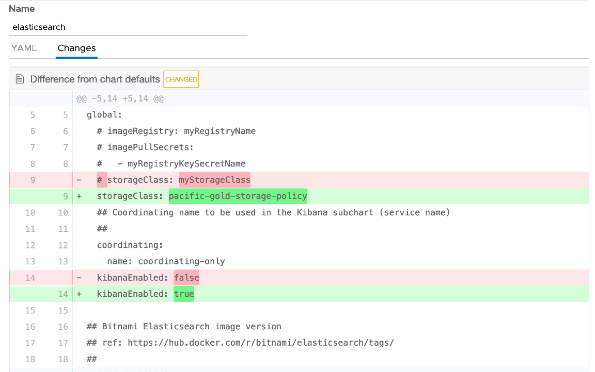  

  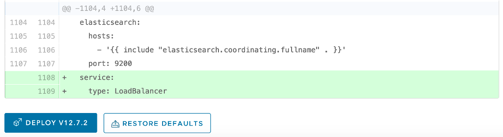    

- 설치가 완료되면, *Installation Notes* 아래에 있는 elasticsearch 내부 DNS와 Port를 확인해 둡니다. 이후 fluent bit에 로그 전송을 위해 필요합니다. kibana에서 접속 URL도 확인합니다.

  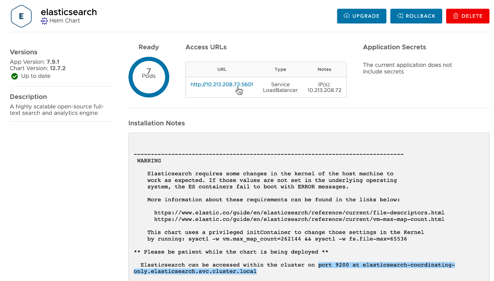     

### FluentBit 설정

- Tanzu Kubernetes Grid Extensions
  * TKG 문서를 보면 추가 구성해서 사용할 수 있는 Dex, FluentBit, Contour에 대한 가이드를 제공하며, 관련 설정 파일을 별도로 제공하고 있습니다.
  * https://docs.vmware.com/en/VMware-Tanzu-Kubernetes-Grid/1.1/vmware-tanzu-kubernetes-grid-11/GUID-manage-instance-index.html

  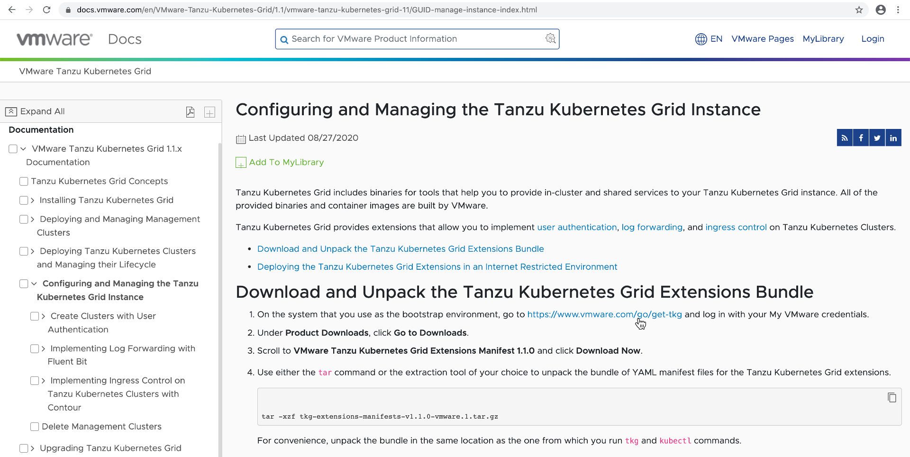  

- 파일 다운로드 링크로 이동하여 관련 파일을 다운로드 받습니다.
  * https://www.vmware.com/go/get-tkg 

  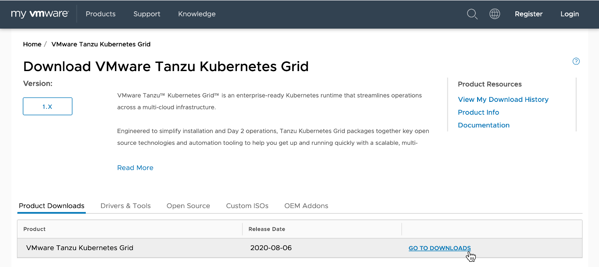   
   

- 다운 받은 파일 압축 해제

tar xvzf tkg-extensions-manifests-v1.1.0_vmware.1.tar.gz
cd tkg-extensions-v1.1.0/logging/fluent-bit/vsphere/


  * Namespace, RBAC 설정
  
kubectl apply -f 00-fluent-bit-namespace.yaml
kubectl apply -f 01-fluent-bit-service-account.yaml
kubectl apply -f 02-fluent-bit-role.yaml
kubectl apply -f 03-fluent-bit-role-binding.yaml


  * Fluent Bit로 Elastic Searcht, Kafka, Splunk, HTTP Endpoint로 전달하는 것을 제공합니다. 여기서는 Elastic Search로 전달하기 위한 템플릿 파일을 사용합니다.

cd output/elasticsearch/


  * 04-fluent-bit-configmap.yaml 수정
    + 각자 환경에 맞게 아래 값을 변경합니다.
  
<TKG_CLUSTER_NAME> to the name of the tkg cluster.
<TKG_INSTANCE_NAME> to the name of tkg instance. This name should be the same for management cluster and all the workload clusters that form a part of one TKG deployment.
<FLUENT_ELASTICSEARCH_HOST> to service name of Elasticsearch within your cluster.
<FLUENT_ELASTICSEARCH_PORT> to the appropriate port Elastic Search server is listening to.

    + 예시
{{< highlight bash "hl_lines=6-7 13-14)   
  filter-record.conf: |
    [FILTER]
        Name                record_modifier
        Match               *
        Record tkg_cluster  tkc-cluster-1
        Record tkg_instance ns1

  output-elasticsearch.conf: |
    [OUTPUT]
        Name            es
        Match           *
        Host            elasticsearch-coordinating-only.elasticsearch.svc.cluster.local
        Port            9200
        Logstash_Format On
        Replace_Dots    On
        Retry_Limit     False    


  * 배포
  
kubectl apply -f 04-fluent-bit-configmap.yaml
kubectl apply -f 05-fluent-bit-ds.yaml


### Kibana 설정

- 설치한 kibana에 로그인합니다.
  * 오른쪽 아래 Elasticsearch Index 만들기 클릭

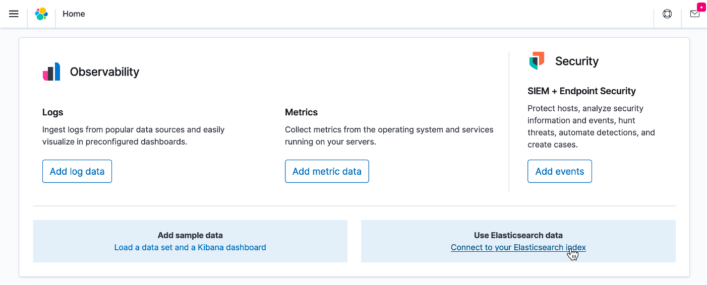   

- 인덱스 패턴으로 `logstash-*` 입력

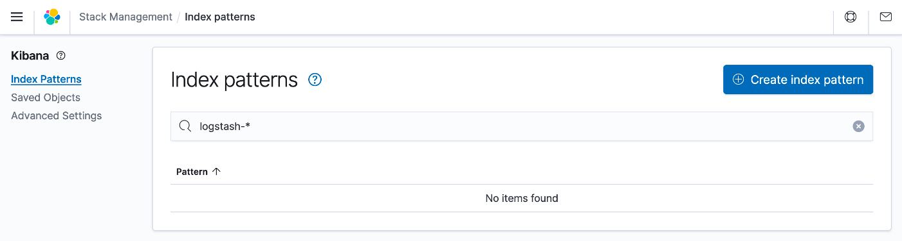    

- 패턴이름으로 동일하게 `logstash-*` 입력

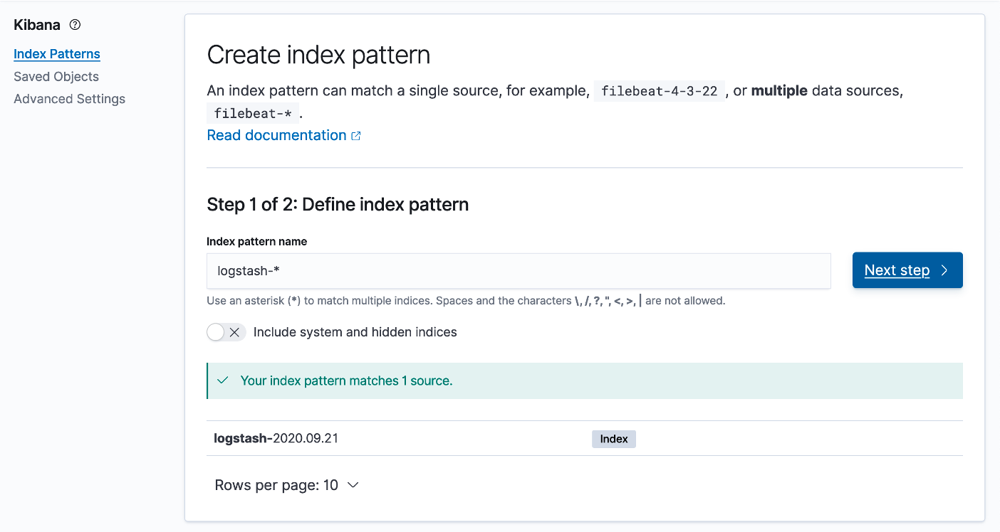   

- 시간 필드로 `@timestamp` 입력

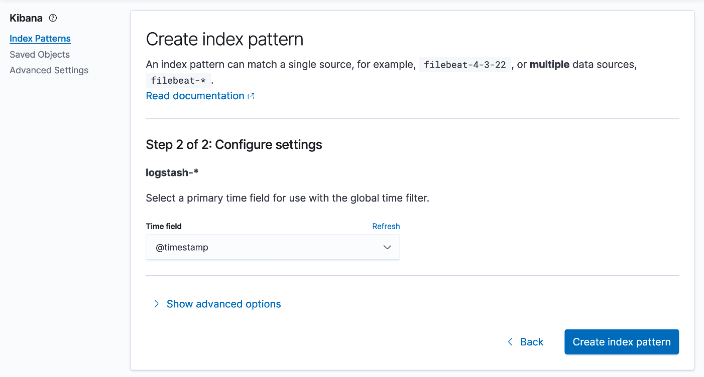   

- 현재 클러스터에 배포되어 있는 앱을 검색해 보면 관련 로그가 보이는 것을 확인할 수 였습니다.

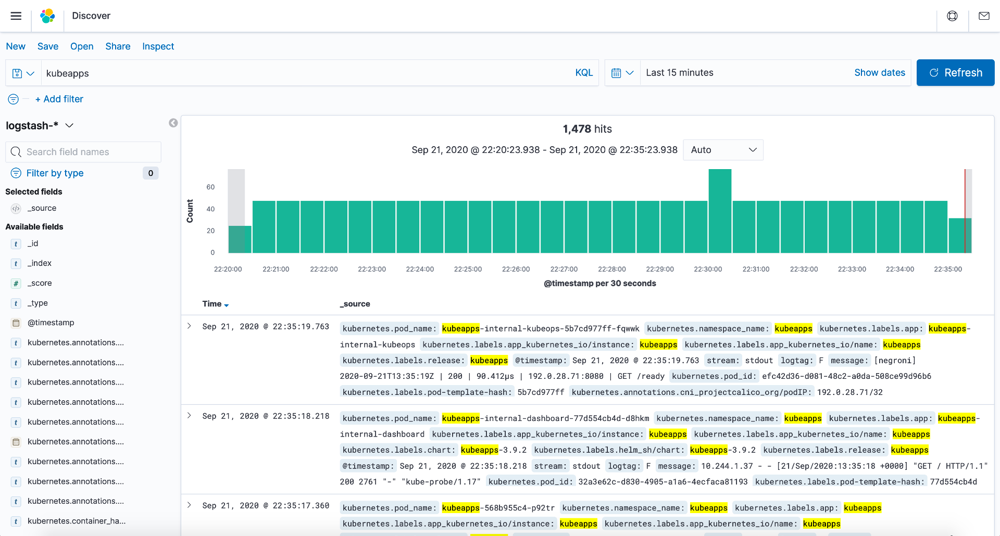   
  